**Note:** For the screenshots, you can store all of your answer images in the `answer-img` directory.

## Verify the monitoring installation

*TODO:* run `kubectl` command to show the running pods and services for the three components. Copy and paste the output or take a screenshot of the output and include it here to verify the installation

**Prometheus Stack:**

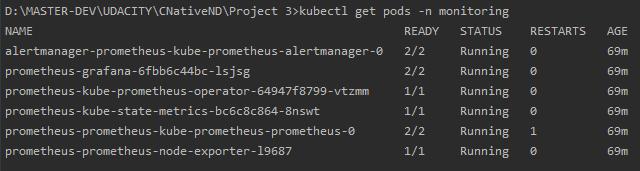
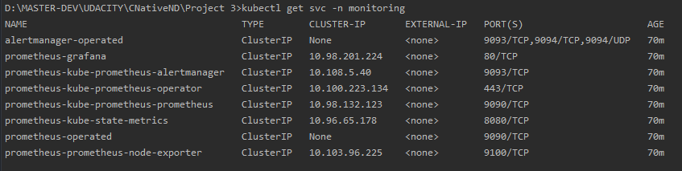

**Observability:**

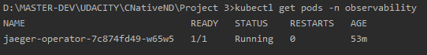
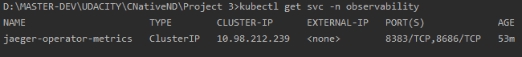

**Application:**

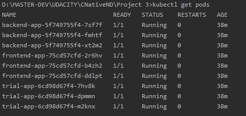
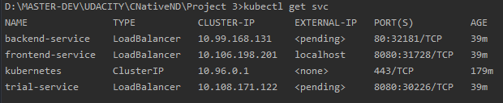
## Setup the Jaeger and Prometheus source
*TODO:* Expose Grafana to the internet and then setup Prometheus as a data source. Provide a screenshot of the home page after logging into Grafana.
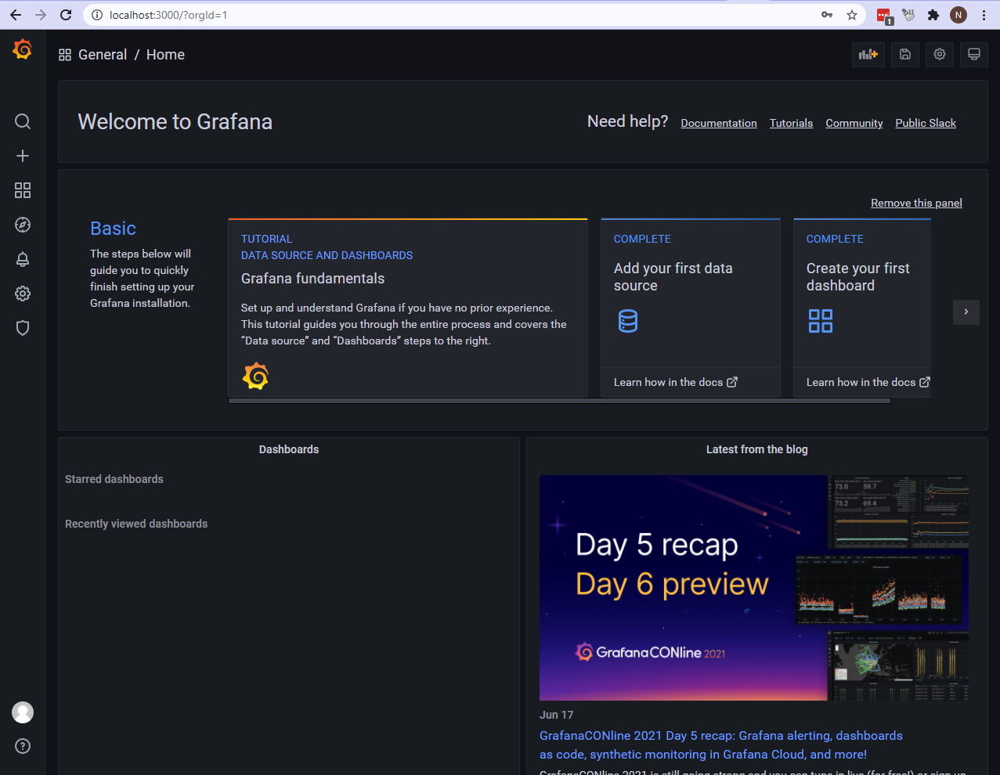
## Create a Basic Dashboard
*TODO:* Create a dashboard in Grafana that shows Prometheus as a source. Take a screenshot and include it here.
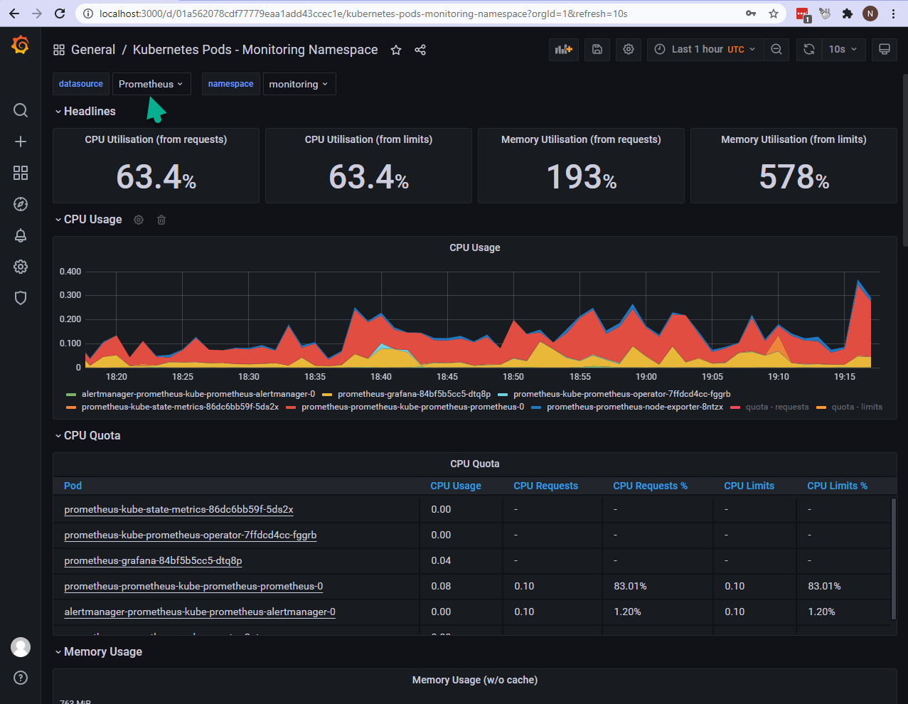
## Describe SLO/SLI
*TODO:* Describe, in your own words, what the SLIs are, based on an SLO of *monthly uptime* and *request response time*.

Describe SLO/SLI
TODO: Describe, in your own words, what the SLIs are, based on an SLO of monthly uptime and request response time.

- SLIs are specific measurements of an acitivity or event during a period of time, that can reflect/compare the realization of an SLO, which is an Objective to be achieved/expected during that period of time. So SLI's are reality/SLO's are desired/expected reality.

- So, a specific measurement of uptime during some month: 97.1% uptime for March (example) is an SLI compared to SLO of 95.5% uptime for March, which is a Goal/Desired/Expected.

- Same would be, The avergae response time for March 194ms(example), compared to SLO of 200ms response time for March, which is again some goal or desired execpetation to not be crossed. 

- Here we took an example of two Metrics, Latency and Uptime/Availability of Service.

## Creating SLI metrics.
*TODO:* It is important to know why we want to measure certain metrics for our customer. Describe in detail 5 metrics to measure these SLIs. 

Here we have 5 Metrics that we can measure for the Application as SLIs.

- Latency
	- This is a metric we take into consideration in regards to measuring the response time of the service we offer. How much delay does the customer experience when interacting/using our service during a period of time. This is very important for the operation of business, as if left neglected can be cause of loosing clients, and it is dirct refelction of user experience. 
- Error rate
	- This metric is an indicator of down-time. How much down-time is caused by the error rate and is it under the Error Budget, which is the (100% uptime - SLO) - meaning that we should be under our allowed limits of a specific period of time. This metric is very important because Down Time is inevitable, but should be kept to minimum as it reflects the business and clients directly.
- Network capacity
	- This metric is important, because it relates to our Network capacity to handle the request for the usage of our service. Even if we take care of Error Rate and Latency, if we don't have enough netowrk capacity and don't monitor how it is spent and what is causing spike on it, we eventually can lead to a road block of not being able to handel certain amount of network trrafic. Here we need to ensure that sufficient bandwidth is provisioned to meet our SLA/SLO targets of delay, jitter, loss, and availability of our Service.
- Traffic
	- This metric is deirectly related with Network Capacity metric but also it can be releted to Latency and Uptime. Here we measure how much traffic we are getting during periods of time, where, what kind of traffic, and where the traffic is coming from and what is targetting. This is getting to know the other side and what is coming on our system. Kind of request, ports, which service is being targeted the most, if we offer multiple services to the outside world through the API. Which API calls are most acctively, etc.
- Uptime
	- All the metric above are interrelated with the Uptime metric in one way or another, they can be some sort of a cause that effects this metric. While the metric is a direct mesaurement of our Service Availability during a period of time. Here will will measure how much our service is accesible and serving properly during a peiod of time. We monitor and measure response times and available services by targeting certain ports/services.

## Create a Dashboard to measure our SLIs
*TODO:* Create a dashboard to measure the uptime of the frontend and backend services We will also want to measure to measure 40x and 50x errors. Create a dashboard that show these values over a 24 hour period and take a screenshot.
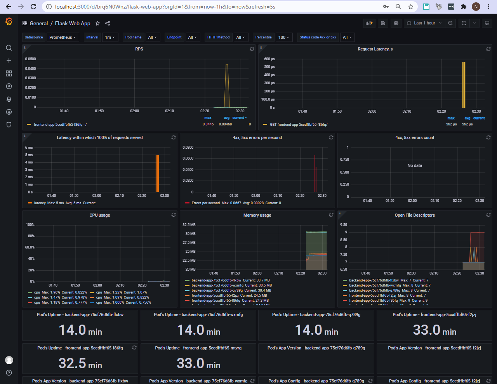
## Tracing our Flask App
*TODO:*  We will create a Jaeger span to measure the processes on the backend. Once you fill in the span, provide a screenshot of it here.
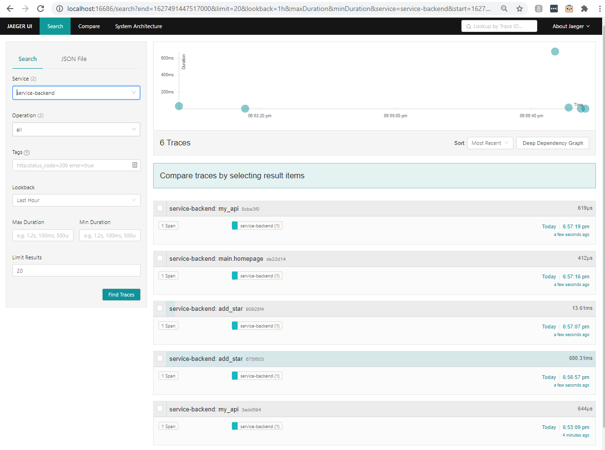
## Jaeger in Dashboards
*TODO:* Now that the trace is running, let's add the metric to our current Grafana dashboard. Once this is completed, provide a screenshot of it here.
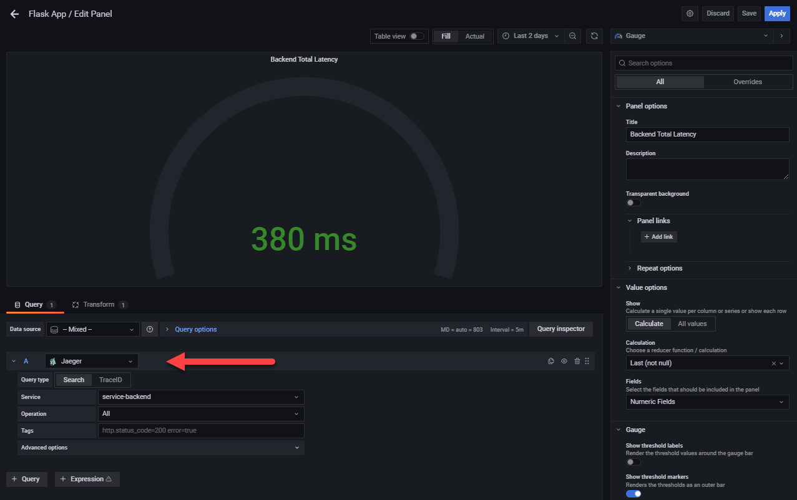
## Report Error
*TODO:* Using the template below, write a trouble ticket for the developers, to explain the errors that you are seeing (400, 500, latency) and to let them know the file that is causing the issue.

TROUBLE TICKET

**Name:** Backend Issues

**Date:** 4 Aug 2021 / 10PM

**Subject:** Backend /star API failing

**Affected Area:** Backend Service

**Severity:** Urgent

**Description:** Backend /star api is failing to connect with MongoDB, please see the TOOLS.MD for help.

## Creating SLIs and SLOs
*TODO:* We want to create an SLO guaranteeing that our application has a 99.95% uptime per month. Name three SLIs that you would use to measure the success of this SLO.

- **Latency** : Monthly Goal: Requests within the month will take less than 30ms
- **Error rate** : Monthly Goal: 99% of all HTTP status will be 20x within the month
- **Uptime** :  Monthly Goal: 99.99% service reachable within the given month

## Building KPIs for our plan
*TODO*: Now that we have our SLIs and SLOs, create KPIs to accurately measure these metrics. We will make a dashboard for this, but first write them down here.

- Number of 40x/50x errors per Month
- Number of 20x HTTP status per Month
- Total Latency in ms per Month for each service
- Total uptime for each service per Month

## Final Dashboard
*TODO*: Create a Dashboard containing graphs that capture all the metrics of your KPIs and adequately representing your SLIs and SLOs. Include a screenshot of the dashboard here, and write a text description of what graphs are represented in the dashboard.  

- Jaeger Flask Metrics : It measures the total latency for each service.
- Flask Application Metrics: It measures for each service the Uptime/Errors/200HttpStatuses/CPU-Memory/Request Latency etc per period of time.
- BlackBox Exporter: It checks for the Status/State of Services continously, and Probe duratios for the services.

 